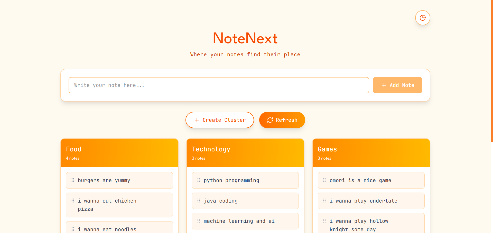

# NoteNext 
> *Where your notes find their place*



NoteNext is an AI-powered note organizer that automatically groups your notes into semantic clusters. Just type a note — the app figures out where it belongs.

---

## How It Works

When you add a note, the backend encodes it using a sentence transformer model and compares it against existing clusters using cosine similarity. If a good match is found (against either the cluster title or existing notes), the note is added there. Otherwise, a new cluster is created and its title is auto-generated using a T5 language model.

You can also manually create clusters, rename them, move notes between clusters via drag-and-drop, and view analytics.

---

## Tech Stack

| Layer | Technology |
|---|---|
| Frontend | React 19, Tailwind CSS v4, Vite |
| Backend | FastAPI, Python |
| AI — Embeddings | `sentence-transformers` · `paraphrase-MiniLM-L6-v2` |
| AI — Titles | `transformers` · `google/flan-t5-small` |
| Similarity | `scikit-learn` cosine similarity |
| Drag & Drop | `@dnd-kit/core`, `@dnd-kit/sortable` |
| Charts | Recharts |
| Fonts | League Spartan, JetBrains Mono, B612 Mono |
| Storage | Local `clusters.json` file |

---

## Features

- **Auto-clustering** — Notes are semantically matched to the most relevant existing cluster
- **Auto-titling** — New clusters get a category title generated by Flan-T5 (e.g. "Travel", "Health", "Work")
- **Drag & drop** — Move notes between clusters by dragging
- **Manual controls** — Create clusters, rename them, edit or delete individual notes
- **Title locking** — Manually renamed clusters won't have their title overwritten by the AI
- **Analytics page** — Pie chart and summary table showing note distribution across clusters

---

## Project Structure

```
notes-organizer/
├── backend/
│   ├── main.py              # FastAPI backend — AI logic and REST API
│   ├── requirements.txt     # Python dependencies
│   └── clusters.json        # Auto-generated persistence file (created on first run)
│
├── frontend/
│   ├── public/
│   │   └── vite.svg         # Favicon (replace with your own)
│   ├── src/
│   │   ├── main.jsx         # React entry point
│   │   ├── App.jsx          # Main app component (UI + API calls)
│   │   ├── App.css          # Component-level styles
│   │   └── index.css        # Global styles, fonts, CSS variables
│   ├── index.html           # HTML entry point
│   ├── package.json         # Node dependencies and scripts
│   ├── vite.config.js       # Vite + Tailwind config
│   └── eslint.config.js     # ESLint config
│
├── demo.png                 # App screenshot
└── README.md
```

---

## Getting Started

### Prerequisites

- Python 3.9+
- Node.js 18+

### 1. Backend Setup

```bash
cd backend

# Install Python dependencies
pip install -r requirements.txt

# Start the backend server
uvicorn main:app --reload --port 8000
```

The API will be available at `http://localhost:8000`.

> **Note:** The first run will download the `paraphrase-MiniLM-L6-v2` and `google/flan-t5-small` models. This may take a few minutes depending on your connection.

### 2. Frontend Setup

```bash
cd frontend

# Install Node dependencies
npm install

# Start the dev server
npm run dev
```

The app will be available at `http://localhost:5173`.

### Available Scripts

| Command | Description |
|---|---|
| `npm run dev` | Start development server |
| `npm run build` | Build for production |
| `npm run preview` | Preview production build |
| `npm run lint` | Run ESLint |

---

## API Reference

| Method | Endpoint | Description |
|---|---|---|
| `POST` | `/add_note` | Add a note; auto-clusters it |
| `GET` | `/clusters` | Fetch all clusters |
| `POST` | `/create_cluster` | Manually create an empty cluster |
| `POST` | `/edit_cluster` | Edit title, notes, or delete notes in a cluster |
| `POST` | `/delete_cluster` | Delete an entire cluster |
| `POST` | `/move_note` | Move a note from one cluster to another |

### Example: Add a Note

```bash
curl -X POST http://localhost:8000/add_note \
  -H "Content-Type: application/json" \
  -d '{"note_text": "Book flights to Tokyo for March"}'
```

---

## Configuration

You can tweak the clustering behaviour in `main.py`:

```python
SIMILARITY_THRESHOLD = 0.35    # Minimum cosine similarity score to match a cluster
CLUSTER_FILE = "clusters.json" # Path to the persistence file
```

Lowering the threshold makes clustering more aggressive (notes group more easily). Raising it makes clusters stricter.

The background colour of the app can be customised in `src/index.css`:

```css
:root {
  --custom-app-bg: #FFFAF0; /* Floral white — change to any hex value */
}
```

---

## Dependencies

### Python (`requirements.txt`)
```
fastapi
uvicorn
sentence-transformers
transformers
scikit-learn
pydantic
```

### JavaScript (`package.json`)
```
react ^19.1.1
@dnd-kit/core ^6.3.1
@dnd-kit/sortable ^10.0.0
recharts ^3.3.0
tailwindcss ^4.1.16
lucide-react ^0.546.0
@fontsource/league-spartan
@fontsource/b612-mono
@fontsource/jetbrains-mono
```